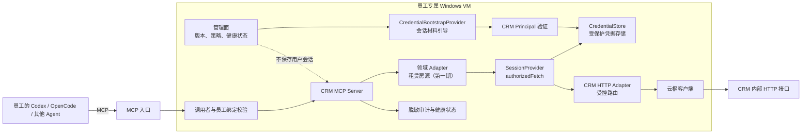
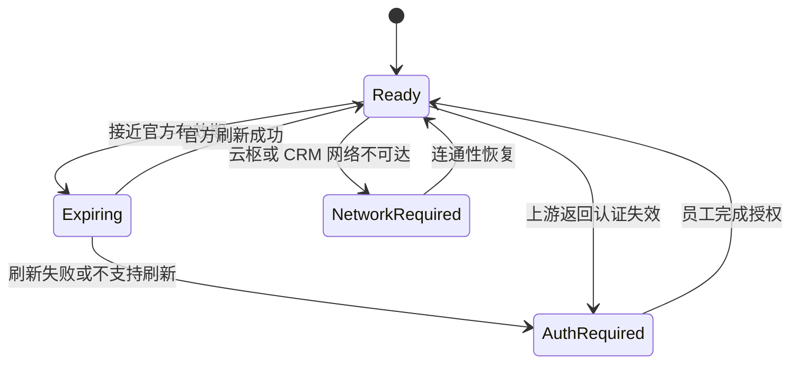

# 个人 CRM MCP Connector：架构与实施任务

## 1. 目标与边界

本方案为每位员工提供一套独立的 CRM MCP Connector，用于将其**本人已有权限范围内**的 CRM 查询能力提供给 Codex、OpenCode 等 Agent。

第一阶段目标：

- 日常查询不依赖浏览器自动化；
- Connector 运行在员工专属、已接入云枢的 Windows VM；
- 对外暴露语义化 MCP 工具，不暴露通用 HTTP 代理；
- 查询请求通过 CRM 的 HTTP 接口执行；
- 认证失效、云枢不可达或上游接口变化时，返回结构化错误并停止业务调用；
- 首期只读，优先完成“房源 → 租赁”查询。

非目标：

- 不建设共享的员工登录态中心；
- 不将凭据、会话材料、二维码或认证头返回给 Agent；
- 不在代码、日志、镜像、测试素材或配置样例中保存真实凭据；
- 不提供任意 URL、任意请求头、任意请求体的 HTTP 转发能力；
- 不在第一阶段支持写入、签约、改价或客户联系方式变更。

## 2. 已知约束

1. CRM 网页访问依赖云枢网络。关闭云枢后，CRM 网页无法正常工作；因此 Connector 的 CRM 请求默认也必须在云枢已连接的 Windows VM 内发起。
2. 当前已观察到 Link/CAS 扫码登录与房源查询页面；未验证 CRM 是否提供正式的 OAuth API 或稳定的服务端 API 契约。
3. 每位员工只服务本人：一台 VM、一套云枢终端身份、一个 CRM 主体、一个 Connector 实例。
4. 稳定性并非第一阶段首要目标，但接口变化、认证失效和网络中断必须可检测、可诊断、可恢复。

### 2.1 可见导航与模块边界

当前已登录页面显示的 CRM 顶层导航为：**首页、房源、客源、线索、签约、签后、应用**。其中“房源”下有：**买卖、租赁、新房、商铺写字楼、小区**。

本服务按下列边界演进：

| 业务域 | 子模块 | 当前状态 |
| --- | --- | --- |
| 房源 | 租赁 | 第一阶段实现，只读 |
| 房源 | 买卖、新房、商铺写字楼、小区 | 预留 |
| 客源、线索、签约、签后、应用 | 顶层业务域 | 预留 |

当前页面中“买卖”提供了全部房源、地铁/学校/地图找房、成交房源、钥匙管理、我的房源和录入房源等能力；它们仅用于识别未来模块边界，不作为第一期交付范围。租赁的实际接口字段在取得其受控接口契约后再固化，避免把买卖字段误用于租赁。

## 3. 总体架构



### 3.1 部署模式

| 场景 | MCP 传输 | 调用者保护 |
| --- | --- | --- |
| Agent 与 Connector 都在同一 VM | `stdio` | Windows 用户边界与进程权限 |
| Agent 在员工电脑，Connector 在员工 VM | Streamable HTTP | 企业私网/SASE + mTLS 或 OIDC/OAuth |

远程 MCP 的调用者主体必须与该 VM 的绑定员工一致。Connector 启动后也应调用 `crm_whoami` 验证 CRM 返回的主体；三者不一致时拒绝业务工具调用。

### 3.2 进程职责

| 进程 | 职责 | 不负责 |
| --- | --- | --- |
| `crm-authd` / 授权中心 | 发起授权、协调引导器、CRM 主体验证、刷新、失效和本地交互 | 房源/客户业务映射、MCP 协议 |
| `CredentialBootstrapProvider` | 从部署侧的认证来源取得或更新当前员工可用的会话材料 | 业务工具、Agent 调用处理 |
| `CredentialStore` | 按员工 VM 持久化当前有效材料、版本和失效状态 | 业务查询、MCP 协议 |
| `crm-connectord` | 领域请求构建、输入与输出校验、CRM 调用编排、脱敏审计 | 向 Agent 暴露凭据 |
| `crm-mcp` | MCP tool 定义、Agent 调用者认证、错误映射 | 保存登录会话或直接处理认证材料 |

`CredentialBootstrapProvider`、`crm-authd` 与 `CredentialStore` 构成认证材料的唯一边界。其他进程只可请求“执行一个已认证的受控请求”，不得获得认证材料本身。

## 4. 核心接口

### 4.1 `CredentialBootstrapProvider`

`CredentialBootstrapProvider` 是部署实现的认证引导扩展点。它的结果必须是当前员工 Connector 可用的认证材料，而非对业务层开放的认证数据。

```ts
interface CredentialBootstrapProvider {
  bootstrap(): Promise<BootstrapResult>;
  refresh(current: ActiveCredential): Promise<BootstrapResult | null>;
  validate(credentialMaterial: unknown): Promise<PrincipalContext>;
  revoke(current: ActiveCredential): Promise<void>;
}
```

授权中心的固定编排：

```text
开始授权 / 刷新授权
  → CredentialBootstrapProvider 获取材料
  → 调用 CRM identity.me 验证主体
  → 校验主体 = CC_BOUND_EMPLOYEE_PRINCIPAL
  → CredentialStore 原子保存新版本
  → 旧版本失效
  → AuthCenter 状态切换为 ready
```

验证失败、主体不一致或引导器未返回有效材料时，状态必须保持 `auth_required` 或 `failed`，不能进入业务查询。

### 4.2 `SessionProvider`

```ts
type AuthStatus =
  | "ready"
  | "expiring"
  | "auth_required"
  | "network_required"
  | "degraded";

type AuthorizedRequest = {
  method: "GET" | "POST" | "PUT";
  route: "identity.me" | "rental_listing.search" | "rental_listing.get_detail";
  query?: Record<string, string | number | boolean | undefined>;
  body?: unknown;
  requestId: string;
};

interface SessionProvider {
  status(): Promise<AuthStatus>;
  authorizedFetch(request: AuthorizedRequest): Promise<UpstreamResponse>;
  beginReauthentication(): Promise<{ sessionId: string; status: AuthStatus }>;
}
```

实现要求：

- `authorizedFetch` 只接受路由别名和结构化参数，不接受 URL 或任意 Header；
- 认证材料不得从接口返回；
- 认证失效时抛出可识别的 `CRM_AUTH_REQUIRED`；
- 云枢未连接或 CRM 网络不可达时返回 `CRM_NETWORK_REQUIRED`；
- 所有调用带 `requestId`，用于关联日志；
- 并发刷新必须加锁，避免多个 Agent 同时触发认证更新。
- `authorizedFetch` 从 `CredentialStore` 读取当前有效材料，通过 CRM HTTP Adapter 调用受控路由；不自行决定认证来源。

### 4.3 `CredentialStore`

`CredentialStore` 只被 `crm-authd` 使用，用于保存当前员工 Connector 的有效认证材料及最小会话元数据。

```ts
interface CredentialStore {
  save(input: {
    sessionId: string;
    employeePrincipal: string;
    credentialMaterial: unknown;
    expiresAt?: Date;
    credentialVersion: number;
  }): Promise<void>;
  loadActive(): Promise<ActiveCredential | null>;
  invalidate(sessionId: string, reason: "expired" | "upstream_rejected" | "replaced"): Promise<void>;
  clearExpired(now: Date): Promise<number>;
}
```

实现规则：

- 认证成功后，先验证 CRM 主体，再原子保存新认证材料并使旧会话失效；
- `SessionProvider.authorizedFetch()` 只能从 `CredentialStore` 获取当前有效材料并注入受控请求；
- 上游明确返回认证失效时，立即调用 `invalidate()`，状态切换为 `auth_required`；
- MCP、业务 Adapter、REST 响应、授权中心页面和日志只能看到状态、会话 ID、到期时间等非敏感元数据；
- 认证材料不进入 SQLite、普通文件、`.env`、镜像、快照、测试夹具或集中管理面；
- Windows VM 使用当前 Connector 运行账户可访问的受保护凭据存储或 DPAPI 加密存储。

### 4.4 CRM 路由注册表

每个业务能力都使用受控路由定义，不提供通用请求代理。

```ts
interface CrmRoute<Input, Output> {
  name: "identity.me" | "rental_listing.search" | "rental_listing.get_detail";
  buildRequest(input: Input, principal: PrincipalContext): AuthorizedRequest;
  parseResponse(response: UpstreamResponse): Output;
}
```

路由注册表保存：请求方法、路径别名、允许参数、请求构建规则、响应 Schema、错误码映射。真实上游地址仅由部署环境配置注入，不能写入仓库。

## 5. MCP 工具设计

### 5.1 第一阶段：只读工具

| 工具 | 用途 | 风险等级 |
| --- | --- | --- |
| `crm_connection_status` | 返回云枢、认证和上游连通状态 | 低 |
| `crm_whoami` | 校验当前 CRM 主体与本机员工绑定 | 低 |
| `rental_listing_search` | 查询租赁房源 | 中 |
| `rental_listing_get_detail` | 查询单套租赁房源详情 | 中 |

`rental_listing_search` 的输入使用业务语言。首期只固化租赁与买卖共通的检索字段；租金、出租方式和租期等租赁专属字段需在确认租赁接口契约后追加：

```json
{
  "communityKeyword": "可选",
  "listingId": "可选",
  "maintainer": "可选",
  "scope": "my_maintained",
  "districts": ["示例区域"],
  "monthlyRentYuan": { "min": 2000, "max": 5000 },
  "areaSqm": { "min": 70, "max": 110 },
  "rooms": [2, 3],
  "orientations": ["南", "南北"],
  "tags": ["地铁房"],
  "page": 1,
  "pageSize": 20
}
```

约束：

- `pageSize` 设置上限，例如 50；
- 每个工具设置速率上限；
- 返回值只含完成当前任务所需字段；
- CRM 的真实权限永远优先于 Connector 自己的筛选逻辑；
- 不允许调用方传入或覆盖员工 ID、组织 ID、认证头、Cookie 或上游地址。

### 5.2 后续工具

在租赁只读工具稳定后，按以下顺序扩展：

1. 买卖、新房、商铺写字楼、小区查询；
2. 客户只读查询，默认最小化返回敏感字段；
3. 跟进草稿创建；
4. 明确的写入工具。

写入工具必须增加：人工确认、幂等键、参数预检、变更前后摘要、审计记录与限流。

## 6. 认证与用户交互

### 6.1 认证状态机



### 6.2 授权中心

扫码或其他人工授权应展示在 VM 的独立“CRM Connector 授权中心”中，而不是嵌入 MCP 工具响应。

授权中心应展示：

- 当前绑定员工和 VM 标识；
- 云枢连接状态；
- 当前状态：等待授权、已扫描、等待手机确认、成功、已过期；
- 二维码有效期与刷新操作；
- 明确的“授权成功后业务工具将自动恢复”说明。

MCP 只返回如下类型的错误，不返回二维码、会话材料或认证 URL：

```json
{
  "code": "CRM_AUTH_REQUIRED",
  "message": "CRM 授权已失效，请在员工专属 Connector 授权中心完成授权。",
  "retryable": false
}
```

### 6.3 认证续期原则

- 优先使用 CRM/SSO 明确支持的刷新机制；
- 不通过模拟点击、伪造活跃或重复业务请求延长会话；
- 无法刷新时，通知员工完成官方授权；
- 登录未恢复前，业务工具失败并保持幂等。

## 7. 配置、存储与日志

### 7.1 配置

配置只保存非敏感信息，例如：

```text
CONNECTOR_INSTANCE_ID
BOUND_EMPLOYEE_PRINCIPAL
MCP_TRANSPORT
MCP_LISTEN_ADDRESS
CRM_ROUTE_PROFILE
LOG_LEVEL
RATE_LIMITS
```

真实凭据、认证材料、Cookie、Token、二维码内容、CRM 真实地址不能进入 `.env.example`、版本库、日志或测试夹具。

### 7.2 本地存储

建议使用本地 SQLite 保存最小运行状态：

- Connector 版本；
- 路由契约版本；
- 认证状态与失效时间（不含认证材料）；
- 任务与调用审计摘要；
- 限流计数与错误统计。

认证材料由 `CredentialStore` 保存到 Windows 受保护凭据存储，且仅 `crm-authd` 可访问。SQLite 仅保存会话 ID、认证状态、到期时间、路由契约版本和脱敏审计摘要。

### 7.3 审计日志

必记字段：

```text
timestamp, request_id, connector_instance_id, caller_subject,
tool_name, result_code, latency_ms, upstream_status
```

默认不记录房源完整地址、客户姓名、电话、认证相关字段或完整上游响应。诊断模式也必须使用字段白名单与脱敏规则。

## 8. 推荐项目结构

```text
services/crm_connector/
  README.md
  pyproject.toml
  app/
    api/
      mcp_server.py
      health.py
    application/
      search_rental_listings.py
      get_rental_listing_detail.py
      get_connection_status.py
    domain/
      models.py
      errors.py
      providers/
        session_provider.py
        credential_store.py
        crm_routes.py
    infrastructure/
      crm_http_adapter.py
      authd_client.py
      sqlite_audit_repository.py
      settings.py
    main.py
  tests/
    unit/
    integration/
```

该目录遵循仓库既有的 `api -> application -> domain <- infrastructure` 依赖方向。若实际采用 TypeScript，应保持同等的分层和接口边界。

## 9. 实施任务

### 阶段 0：前置验证

- [ ] 指定试点员工与专属 Windows VM。
- [ ] 安装并验证云枢；确认 VM 能访问 CRM 网页入口。
- [ ] 定义 Connector 绑定员工标识与 VM 标识。
- [ ] 建立脱敏接口契约清单：身份校验、房源搜索、房源详情。
- [ ] 记录每个接口的请求方法、路由别名、输入字段、分页方式、响应字段与错误码。
- [ ] 确定 `SessionProvider` 的授权、刷新、失效和人工恢复边界。
- [ ] 明确 CRM 数据使用范围、日志保留期和员工授权责任。

**验收标准**：有一份不含真实凭据的接口契约文档；试点 VM 在云枢开启时能访问 CRM，关闭时不可达或按策略被拒绝。

### 阶段 1：授权与连接基础设施

- [ ] 创建 `crm_connector` 服务骨架，并登记服务目录与所有者。
- [ ] 实现健康检查：进程存活、云枢连通、认证状态、上游探测。
- [ ] 实现配置加载、请求 ID、结构化日志与字段脱敏。
- [ ] 实现 SQLite 审计仓储与日志轮转策略。
- [ ] 实现 `CredentialBootstrapProvider` 的部署适配器；不使用 Mock 作为生产链路。
- [ ] 实现 `CredentialStore` 接口与 Windows 受保护存储适配器。
- [ ] 在认证成功后执行“CRM 主体验证 → 新凭据原子保存 → 旧会话失效”。
- [ ] 上游认证拒绝时执行 `CredentialStore.invalidate()`，并同步更新授权中心状态。
- [ ] 实现 `SessionProvider.authorizedFetch()` 与 CRM HTTP Adapter 的受控路由调用链。
- [ ] 实现认证状态机、刷新互斥锁和 `CRM_AUTH_REQUIRED` 错误。
- [ ] 为本地授权中心预留状态查询和通知接口。

**验收标准**：授权中心可使状态进入 `ready`；无有效授权时所有业务调用返回 `CRM_AUTH_REQUIRED`；云枢不可达时返回 `CRM_NETWORK_REQUIRED`；日志无认证材料。

### 阶段 2：租赁房源查询 POC

- [ ] 实现 `identity.me` 路由和 `crm_whoami`。
- [ ] 实现员工主体与 Connector 绑定校验。
- [ ] 实现 `rental_listing.search` 请求构建、响应解析与分页。
- [ ] 实现 `rental_listing.get_detail`。
- [ ] 为输入、输出和上游错误建立 Schema 校验。
- [ ] 添加租赁房源结果字段最小化与数据脱敏策略。
- [ ] 在授权员工范围内抽样比对 Connector 查询结果与租赁页面结果。

**验收标准**：Connector 在不启动浏览器的情况下可完成授权范围内的租赁房源查询；结果分页、筛选和错误状态符合契约。

### 阶段 3：MCP 接入

- [ ] 定义 MCP tools、描述、输入 Schema 与返回 Schema。
- [ ] 支持 `stdio` 模式。
- [ ] 如需远程调用，支持 Streamable HTTP 与调用者认证。
- [ ] 实现调用者主体、VM 绑定员工、CRM 主体三方一致性校验。
- [ ] 添加工具级限流、只读工具白名单和超时控制。
- [ ] 编写 MCP 契约测试和 Agent 调用样例。

**验收标准**：Agent 只能发现并调用允许的语义工具；无法提交任意 URL、认证头或跨员工参数。

### 阶段 4：可靠性与运维

- [ ] 为认证失效、云枢断开、上游 4xx/5xx、契约解析失败设置告警。
- [ ] 配置 Connector 自启动与异常重启。
- [ ] 提供“连接状态”和“需要人工授权”的本地通知。
- [ ] 增加路由契约版本号；上游解析失败时快速降级为 `CRM_UPSTREAM_CHANGED`。
- [ ] 实现只含脱敏摘要的诊断包。
- [ ] 制定 VM 补丁、备份、销毁与员工离职时的凭据清理流程。

**验收标准**：认证、网络和上游接口故障都有清晰、非误导性的错误状态与恢复路径。

### 阶段 5：受控扩展

- [ ] 增加买卖、新房、商铺写字楼、小区查询。
- [ ] 增加客户只读工具，先执行字段最小化与权限评审。
- [ ] 评审写入用例。
- [ ] 写入工具增加确认、幂等键、前后摘要和审计后再上线。
- [ ] 为每位新员工使用无凭据基础镜像创建独立 VM 和 Connector。

## 10. 测试计划

| 编号 | 场景 | 预期结果 |
| --- | --- | --- |
| T1 | 云枢已连接、认证有效、租赁房源查询 | 返回通过 Schema 校验的分页结果 |
| T2 | 云枢断开 | 返回 `CRM_NETWORK_REQUIRED` 或网络层受控错误 |
| T3 | 认证失效 | 返回 `CRM_AUTH_REQUIRED`，不触发业务重试 |
| T4 | 调用者员工与 VM 绑定员工不一致 | 返回拒绝错误，不请求 CRM |
| T5 | CRM 主体与 VM 绑定员工不一致 | Connector 进入降级状态并拒绝业务调用 |
| T6 | Agent 提交未知筛选字段 | 本地 Schema 校验失败，不请求 CRM |
| T7 | 上游接口响应字段变化 | 返回 `CRM_UPSTREAM_CHANGED`，记录脱敏诊断 |
| T8 | 并发调用触发认证刷新 | 只允许一个刷新操作，其他请求等待或返回明确状态 |
| T9 | 日志与审计检查 | 不包含认证材料、完整客户联系方式或完整上游响应 |
| T10 | 新认证成功 | 先校验 CRM 主体，再原子保存新凭据并使旧会话失效 |
| T11 | 上游认证失效 | 凭据被失效，后续业务调用返回 `CRM_AUTH_REQUIRED` |
| T12 | 凭据存储清理 | 过期材料被清理；SQLite 和日志只含非敏感元数据 |
| T13 | 凭据引导成功 | BootstrapProvider 返回材料后，CRM 主体通过绑定校验，状态进入 `ready` |
| T14 | 凭据引导失败 | Provider 无有效结果或主体不一致，状态保持 `auth_required`/`failed`，不请求租赁路由 |
| T15 | 已认证租赁请求 | SessionProvider 通过 CRM HTTP Adapter 调用受控租赁路由，返回经 Schema 校验的数据 |

## 11. 上线门槛

以下条件全部满足后，才允许扩大到更多员工：

1. 试点员工在云枢连接环境下可用 API 查询完成真实日常任务；
2. 无浏览器常驻进程；
3. 认证失效、云枢断开、上游变化均有可操作的错误提示；
4. 认证材料不在仓库、日志、审计库或 MCP 响应中出现；
5. 调用者、VM、CRM 主体一致性校验通过；
6. 租赁只读查询的业务结果经人工抽样确认；
7. VM、云枢和 Connector 的所有权、更新和退出清理责任明确。

## 12. 待确认决策

- CRM 认证是否存在可由非浏览器客户端使用的正式刷新机制；
- 需要支持 `stdio`、远程 MCP，或两者同时支持；
- 员工 Agent 到 VM 的私网与调用者认证方案；
- 首期租赁房源查询允许的字段范围与每分钟调用上限；
- 本地授权中心的实现形态：托盘程序、localhost 页面或远程桌面内桌面应用；
- 审计日志保留时长及诊断数据脱敏规范；
- 何时以及在何种审批条件下开放写入工具。
